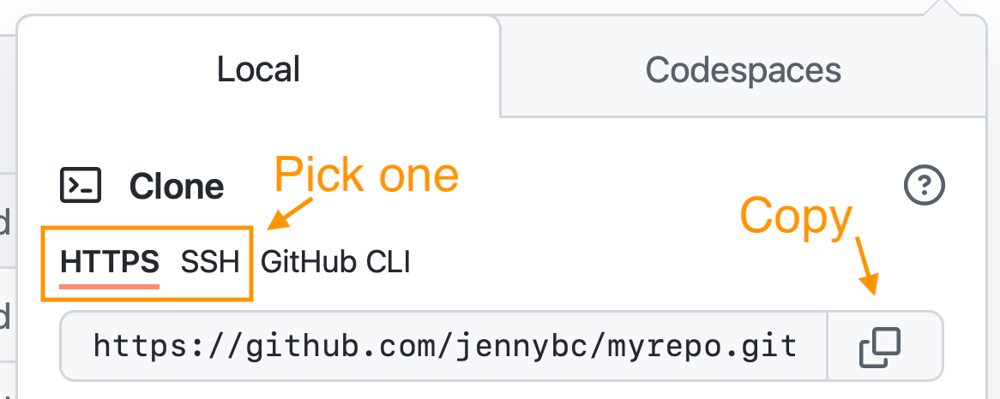

# userInterface
This interface lets you quickly check if you're of legal age. It features a clear title like "Enter" and two simple input fields:   Name: For your name. Age: For your age in years. After entering your details, hit the "Check" button. The result will then appear, telling you clearly if you are "of legal age" or "not yet of legal age." 
# 
Explore the JavaScript world from basic basics to advanced object handling, this repository contains basic information to master Vanilla / Native JavaScript.

# How to use?
## 1. Clone the repository:

git clone https://github.com/ASADDS2/userInterface.git
Clone the repository, preferably via SSH security keys, or you can also use the HTTPS method.
example

## 2. Browse to the Project Directory:

cd userInterface

## 3. Open FileJs.js:

As it is JavaScript vanilla you can run any individual file in the browser or in backend using NodeJs.
Author
This project was created by Sebastian Arnache Cantillo.

If you have questions or comments about the project, you can contact Sebastian Arnache Cantillo at sarnachecantillo@gmail.com

# Contributions
Contributions are welcome! If you have ideas for improvements or new functions, do not hesitate to send them to the main branch

## Project Status
This project is currently under active development and updates are expected in the near future.

# License
This project is under the MIT License - see the LICENSE file for more details.